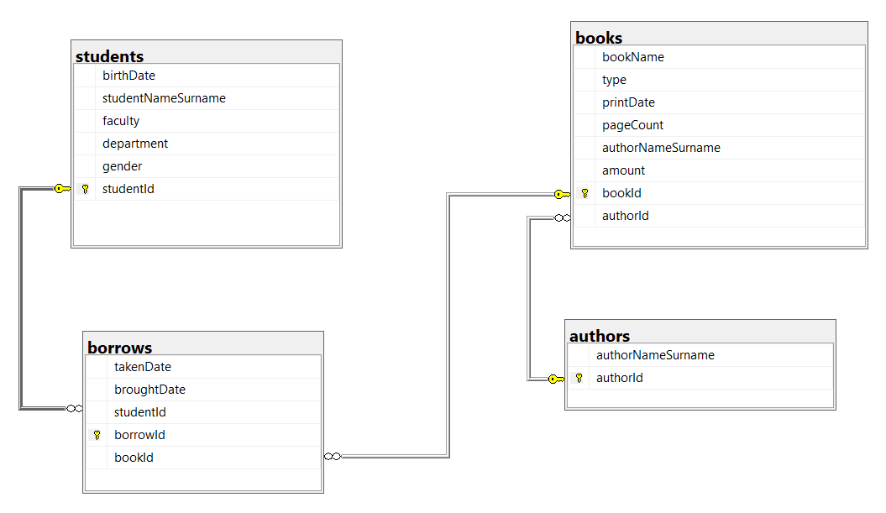

# Library_System

This project is about basic Library system.
Viewing, creating, changing, deleting, borrowing and returning functions have it. This options work with SQL(Microsoft SQL).

The presentations are as shown below

  

  
